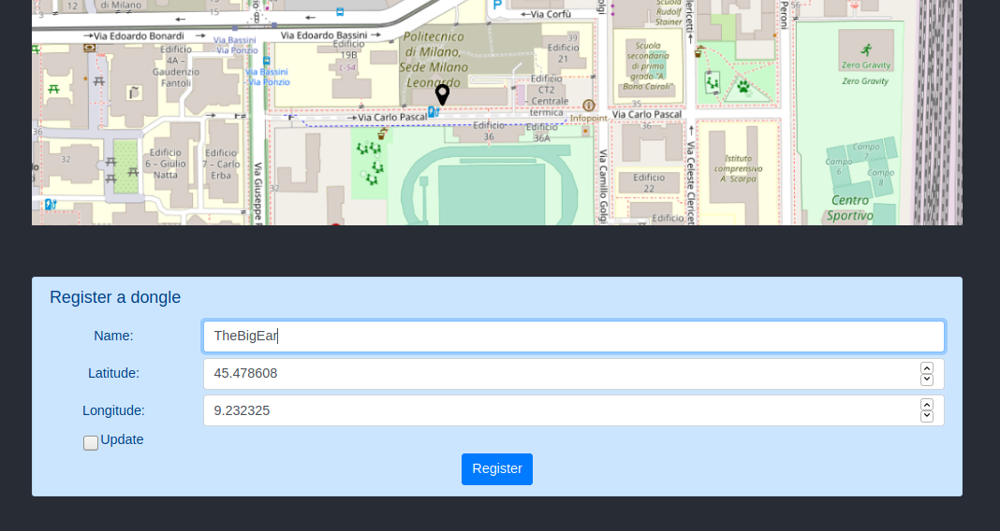
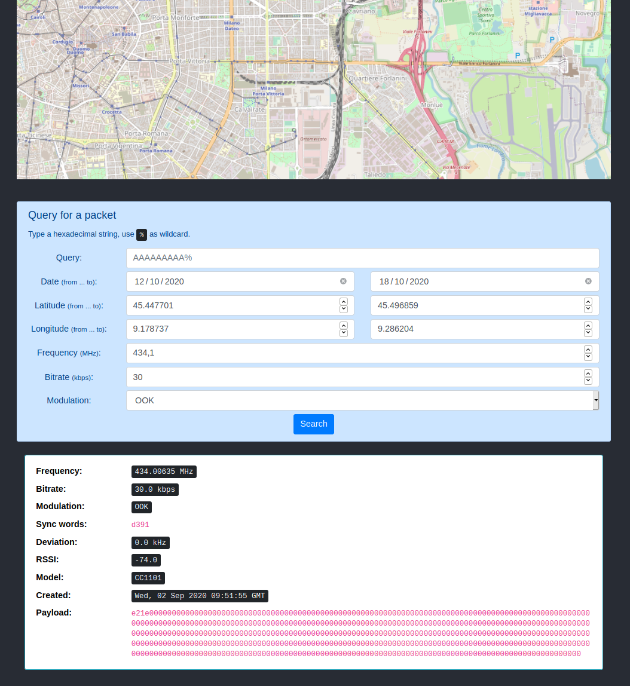
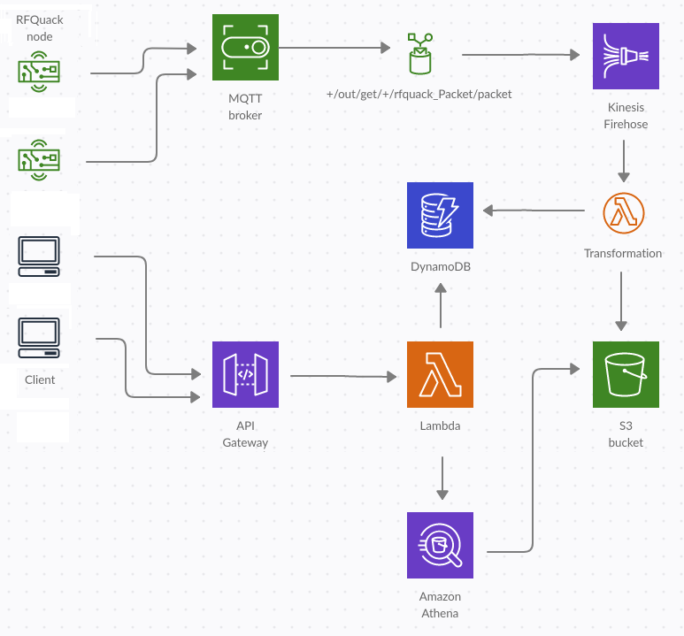

# NetQuack

A distributed system for collecting and searching radio signals through [RFQuack](https://github.com/rfquack/RFQuack).

Using this tool, you can record and store digital radio signals in a global database and perform queries by content, location, timestamp, frequency, bitrate, and other parameters.
The backend of the application is hosted by Amazon Web Services, while the frontend is available both as a web interface and a command-line interface and they communicate through a shared API.

## Deployment

### Backend

In order to deploy the backend on your own you need:

* An account on Amazon Web Services
* [AWS CLI](https://docs.aws.amazon.com/cli/latest/userguide/cli-chap-install.html) installed on your machine
* AWS credentials already configured
* [Terraform](https://www.terraform.io/downloads.html) installed on your machine

Using Terraform, deploying a cloud infrastructure and migrating it to a different account becomes easy and fast. Just run these commands:
```bash
    cd Backend
    bash genesis.sh
```

At the end of the process, your AWS account will host all the necessary services to receive and store packets.
This operation will generate a configuration file called ```config.json``` which will contain three important parameters: 
* ```API_URL```: the API endpoint used to register new dongles and query the global database
* ```MQTT_HOST```: the MQTT endpoint that will store radio packets
* ```MQTT_PORT```: the port number of the MQTT endpoint

These parameters are generated dynamically while deploying the backend and they are needed by the frontend interface to communicate with the backend.

### Web frontend

The web interface of NetQuack is a React application hosted by a Flask server. To deploy the web frontend, first copy ```config.json``` generated by Terraform into ```./Frontend Web/development```, then run these commands:
```bash
    cd "Frontend Web/development"
    npm install
    npm run build
    mv build ../production/build
    cp config.json ../production
    cd ../production
```

Now you can test the application directly with ```python main.py``` or set up a production server with WSGI.

### CLI frontend

To run the command-line interface, just copy ```config.json``` into ```Frontend CLI``` and then launch ```python netquack.py```

## Demo

This tool is designed as an extension of the RFQuack firmware, a flexible software to sniff and manipulate radio packets. To start receiving and storing packets, you need an MCU and a radio chip both compatible with RFQuack. You also need a certificate to connect your device to the system of NetQuack. This can be done through the web interface.
Choose a name for your device, select its position on the map and click "Register". Your device will be registered on the NetQuack system and you will receive a certificate and instructions on how to use it to connect your dongle to the network.



Now you can use your dongle with all the features offered by RFQuack. All radio packets received by your radio will be automatically stored in the global database of NetQuack and the web interface lets you perform queries over it.



Currently, queries can be performed by:
* **Payload content** over the alphabet ```0123456789abcdef``` and the wildcard ```_``` for a single hex value and ```%``` for any hex string
* **Location** through box coordinates
* **Date** in a range up to seven days
* **Frequency** with a tolerance of 1 MHz around the specified value
* **Bitrate** with a tolerance of 1 kbps around the specified value
* **Modulation** among OOK, FSK2 and GFSK

## Architecture

The firmware of RFQuack can be controlled by a [command-line interface](https://github.com/rfquack/RFQuack-cli) through serial or MQTT communication. The main idea of NetQuack is that the MQTT broker is a remote server hosted on the Amazon cloud (**IoT Core**), which triggers some events upon receiving specific messages.
Every time the MQTT broker receives a packet (that is a message matching the topic ```+/out/get/+/rfquack_Packet/packet```), this packet is forwarded to a buffer (**Kinesis Firehose**). When the buffer gets full, the collected packets are converted into Apache Parquet, an efficient and compressed data format, and then stored into an **S3** bucket, a cloud data storage managed by AWS.
These data can be queried using **Athena**, a serverless interactive query engine that makes it possible to use standard SQL over data stored in various formats.
The layer between the final user and the backend is a REST API built through **API Gateway**, which lets the user register new dongles and perform queries, using the services provided by IoT Core and Athena.
Further data are stored into **DynamoDB**, a No-SQL database which is used as a support for auxiliary data such as the location of dongles and query caching (not supported natively by Athena).



## API documentation

The API documentation is available [here](https://app.swaggerhub.com/apis-docs/FiorixF1/netquack-api/1.0).
